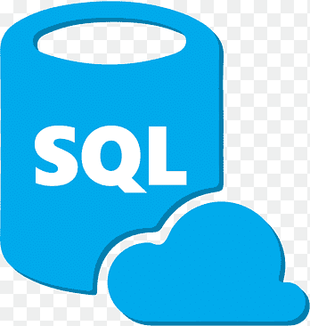

## POKEMON BATTLE FRONTIER

:wave: Soy Raquel Moya. 
:computer: Soy una estudiante de FSD en <kbd>⇥</kbd>  

### Sobre el proyecto

Este proyecto consiste en replicar la parte Backend de un servicio de alquiler de películas. 

A continuación encontraréis detallados cada uno de los endpoints y de las funcionalidades de este Backend.

### Instrucciones 🔧

El primer paso para arrancar el proyecto es clonar este repositorio en vuestro repositorio local.

A continuación, debemos instalar las dependencias no incluidas en el repositorio al utilizar el archivo .gitignore. Para ello, debemos introducir en el terminal el siguiente comando: 

### `npm i`

Inicializamos Sequelize con el siguiente comando:

### `sequelize init`

Realizamos la migración de los modelos a la base de datos local.

### `sequelize db:migrate`

Arrancamos el servidor

### `npm run dev`

Y ya podríamos introducir las peticiones con los endpoints que detallaremos a continuación en Postman para visualizarlos

## Endpoints

- Movies
   - GET /movies--> Muestra todas las películas.
   - GET /movies/id/:id --> Muestra una película buscando por su Id.
   - GET /movies/title/:title --> Muestra una película buscando por su título.

 

- Users

- User Login
   - POST /login --> Es necesario hacer login con un user ya registrado para obtener un token (clave) que permita el acceso a algunos endpoints que necesitan permisos. Algunos endpoints solo permiten el acceso si el usuario es Administrador.

   - POST /users --> Permite registrar un nuevo usuario.
   - GET /users--> Muestra todos los usuarios registrados(solo acceso como Administrador).
   - GET/users/:id --> Muestra un usuario buscando con un Id (Necesita token).
   - GET /users/email/:email --> Muestra un usuario buscando con un email (Necesita token).
   - PUT /users/newpassword --> Modifica el password actual de un usuario (Necesita token).
   - PUT /users/:id --> Modifica datos de usuario (Necesita token).
   - DELETE /users --> Elimina todos los usuarios (Solo acceso como Administrador). 
    - DELETE /users/delete/:id--> Elimina un usuario buscando con un Id (Solo acceso como Administrador).
 

- Orders
   - POST /orders -->  Crea un nuevo pedido (Necesita token).
   - GET/orders --> Muestra todos los pedidos (Solo acceso como Administrador).

 

- Genres
   - GET/genres --> Muestra todos los generos.

 

- GenreMovie
   - GET/genreMovie --> Muestra todos los generos asignados a películas.
   - POST/genreMovie --> Crea una nueva asignación de género a película (Solo acceso como Administrador).

 

- Actors
   - GET/actors --> Muestra todos los actores/actrices.

 

- Acts
   - GET/act --> Muestra todas los actuaciones asignadas a películas.
   - POST/act --> Crea una nueva asignación de actores a películas (Solo acceso como Administrador).

## Models relation

La relación entre users y movies es "many to many", por lo que debemos crear una relación intermedia (Orders).

La relación entre users y orders es "1 to many" (1:n), y la relación entre movies y orders es exáctamente la misma (1:n).

Entre movies y actors, o genres, pasa lo mismo. La relación entre ellos precisa de una relación intermedia, por lo que las relacionamos mediante la tabla acts y la tabla genreMovies.

## Tecnologías y dependencias utilizadas

 

 

 

Puedes ver este proyecto en: <kbd>⇥</kbd> [GitHub pages](https://raquelmoya.github.io/JSGame)

## Developers ✍️

[Raquel Moya](https://github.com/RaquelMoya)

Última edición: 27/02/2022